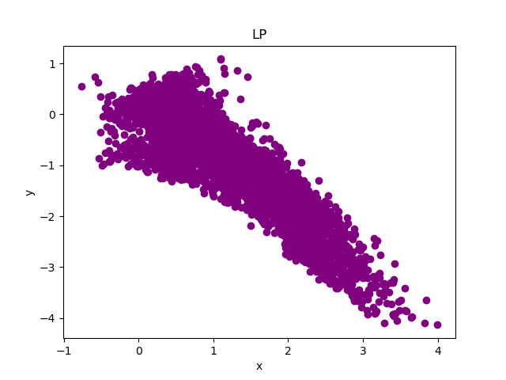
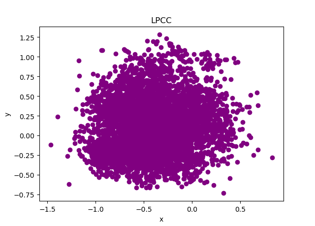
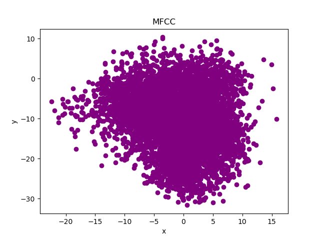
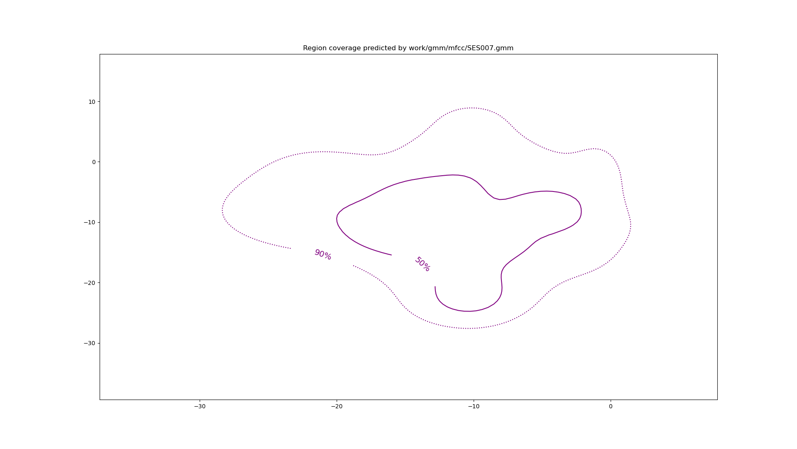
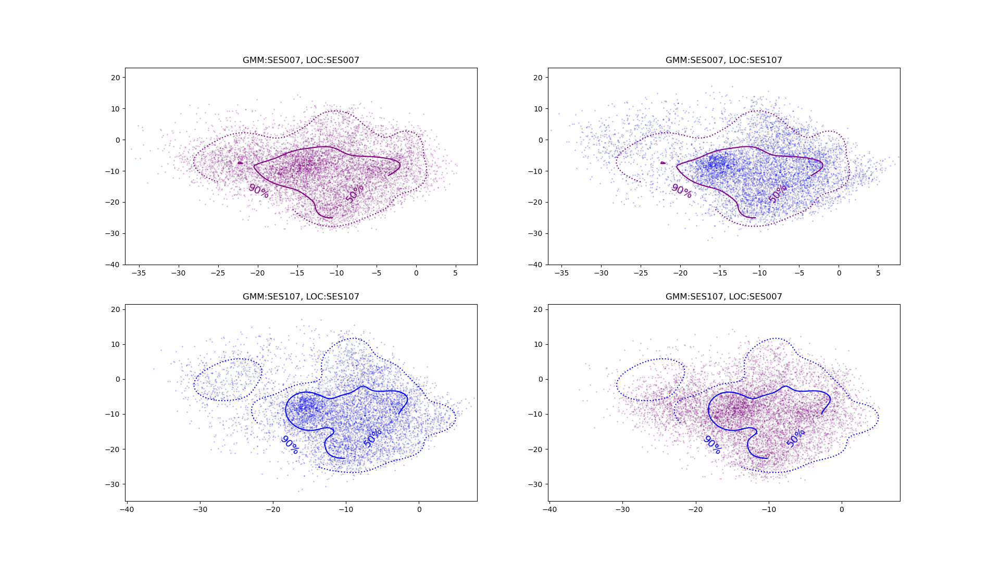

PAV - P4: reconocimiento y verificación del locutor
===================================================

Obtenga su copia del repositorio de la práctica accediendo a [Práctica 4](https://github.com/albino-pav/P4)
y pulsando sobre el botón `Fork` situado en la esquina superior derecha. A continuación, siga las
instrucciones de la [Práctica 2](https://github.com/albino-pav/P2) para crear una rama con el apellido de
los integrantes del grupo de prácticas, dar de alta al resto de integrantes como colaboradores del proyecto
y crear la copias locales del repositorio.

También debe descomprimir, en el directorio `PAV/P4`, el fichero [db_8mu.tgz](https://atenea.upc.edu/mod/resource/view.php?id=3654387?forcedownload=1)
con la base de datos oral que se utilizará en la parte experimental de la práctica.

Como entrega deberá realizar un *pull request* con el contenido de su copia del repositorio. Recuerde
que los ficheros entregados deberán estar en condiciones de ser ejecutados con sólo ejecutar:

~~~~~~~~~~~~~~~~~~~~~~~~~~~~~~~~~~~~~~~~~~~~~~~~~~~~~.sh
  make release
  run_spkid mfcc train test classerr verify verifyerr
~~~~~~~~~~~~~~~~~~~~~~~~~~~~~~~~~~~~~~~~~~~~~~~~~~~~~

Recuerde que, además de los trabajos indicados en esta parte básica, también deberá realizar un proyecto
de ampliación, del cual deberá subir una memoria explicativa a Atenea y los ficheros correspondientes al
repositorio de la práctica.

A modo de memoria de la parte básica, complete, en este mismo documento y usando el formato *markdown*, los
ejercicios indicados.

## Ejercicios.

### SPTK, Sox y los scripts de extracción de características.

- Analice el script `wav2lp.sh` y explique la misión de los distintos comandos involucrados en el *pipeline* principal (`sox`, `$X2X`, `$FRAME`, `$WINDOW` y `$LPC`). Explique el significado de cada una de las 
  opciones empleadas y de sus valores.
  ``` bash 
  sox $inputfile -t raw -e signed -b 16 - | $X2X +sf | $FRAME -l 240 -p 80 | $WINDOW -l 240 -L 240 |
	$LPC -l 240 -m $lpc_order > $base.lp || exit 1
  ```
  - **`sox`**: convierte el archivo de entrada en un flujo de datos en bruto (`raw`) con codificación de enteros con signo (`signed`) de 16 bits (`-b 16`).
  - **`$X2X +sf`**: convierte los datos de entrada de formato de muestra (`+sf`) a un formato adecuado para el procesamiento posterior.
  - **`$FRAME -l 240 -p 80`**: segmenta los datos en marcos de 240 muestras (`-l 240`) con un paso de 80 muestras (`-p 80`).
  - **`$WINDOW -l 240 -L 240`**: aplica una ventana de 240 muestras (`-l 240`) con una longitud de ventana de 240 (`-L 240`).
  - **`$LPC -l 240 -m $lpc_order`**: calcula los coeficientes de predicción lineal (LPC) con una longitud de 240 (`-l 240`) y un orden especificado por `$lpc_order` (`-m $lpc_order`).

- Explique el procedimiento seguido para obtener un fichero de formato *fmatrix* a partir de los ficheros de salida de SPTK (líneas 49 a 55 del script `wav2lp.sh`).
  ``` bash
  ncol=$((lpc_order + 1)) # lpc p =>  (gain a1 a2 ... ap) 
  nrow=$(($($X2X +fa < $base.lp | wc -l) / ncol))

  # Build fmatrix file by placing nrow and ncol in front, and the data after them
  echo $nrow $ncol | $X2X +aI > $outputfile
  cat $base.lp >> $outputfile
  ```
  - Primero, se calcula el número de columnas (`ncol`) como el orden de LPC más uno, ya que el archivo LPC contiene el valor de ganancia seguido de los coeficientes LPC.
  - Luego, se calcula el número de filas (`nrow`) dividiendo el número total de valores en el archivo LPC por el número de columnas.
    - `X2X + fa` : convierte el archivo `$base.lp` a ASCII
    - `wc -l` : cuenta el número de líneas
    - Dividimoes entre `ncol` para obtener las filas

  - Finalmente, se construye el archivo *fmatrix* colocando `nrow` y `ncol` al principio, seguidos de los datos LPC.

  * ¿Por qué es más conveniente el formato *fmatrix* que el SPTK?
    - El formato *fmatrix* es más conveniente porque incluye metadatos (número de filas y columnas) que facilitan la lectura y el procesamiento de los datos en etapas posteriores.

- Escriba el *pipeline* principal usado para calcular los coeficientes cepstrales de predicción lineal
  (LPCC) en su fichero <code>scripts/wav2lpcc.sh</code>:
  
  ```bash
  sox $inputfile -t raw -e signed -b 16 - | $X2X +sf | $FRAME -l 240 -p 80 | $WINDOW -l 240 -L 240 |
	$LPC -l 240 -m $lpc_order |
   $LPCC -m $lpc_order -M $lpc2c_order > $base.cep || exit 1
  ```

- Escriba el *pipeline* principal usado para calcular los coeficientes cepstrales en escala Mel (MFCC) en su
  fichero <code>scripts/wav2mfcc.sh</code>:
  ```bash
  sox $inputfile -t raw -e signed -b 16 - | $X2X +sf | $FRAME -l 240 -p 80 | $WINDOW -l 240 -L 240 |
	$MFCC -s $freq_order -l 180 -m $mfcc_order -n $melfilter_order > $base.mfc || exit 1
  ```

### Extracción de características.

- Inserte una imagen mostrando la dependencia entre los coeficientes 2 y 3 de las tres parametrizaciones
  para todas las señales de un locutor.
  
  + Indique **todas** las órdenes necesarias para obtener las gráficas a partir de las señales 
    parametrizadas.
    
    Hacemos los siguientes comandos oara poder ejecutar los scripts `wav2lpcc.sh` y `wav2mfcc.sh` des de la línea de comandos si especificar el intérpreste, en este caso, Bash.
    ```bash
    chmod +x scripts/wav2lpcc.sh
    chmod +x scripts/wav2mfcc.sh
    ```
    Calculamos las preducciones con el `run_spkid` con su correspondiente feature (Lp, lpcc, mfcc)
    ```bash
    FEAT=lpcc ../bin/run_spkid lpcc
    FEAT=mfcc ../bin/run_spkid mfcc
    ```
    Nos quedamos con los coeficientes 2 y 3 de lo que hemos generado anteriormente del locutor SES017 (siguiendo el ejemplo de la práctica)
    ```bash
    fmatrix_show work/lpcc/BLOCK01/SES017/*.lpcc | grep -E '^\[' | cut -f4,5 > ./plot_img/lpcc_2_3.txt
    fmatrix_show work/lp/BLOCK01/SES017/*.lp | grep -E '^\[' | cut -f4,5 > ./plot_img/lp_2_3.txt
    fmatrix_show work/mfcc/BLOCK01/SES017/*.mfcc | grep -E '^\[' | cut -f4,5 > ./plot_img/mfcc_2_3.txt
    ```

    Finalmente hemos generado un programa en python que crea las gráficas necesarias para ver la dependencia de los coeficientes llamado: [plot_coefficients.py](./plot_img/plot_coefficients.py) y obtenemos la siguientes imagenes: 

    
    
    
  + ¿Cuál de ellas le parece que contiene más información?
    
    Como los gráficos ilustran la dependencia entre los coeficientes 2 y 3 de la parametrizaciones, si vemos una correlación entre los coeficientes implica que tener ambas nos aporta menos información.
    Si analizamos los gráficos de arriba:
      
      1. **LP**: la nube de puntoss del gráfico está bastante alineada por lo tanto, mucha información tiene una dependencia linal y no vemos mucha información adicional.
      2. **LPCC**: Este gráfico en cambio, tiene una distribución ddispersa, y implica que se trata de una parametrzacónque contiene más infrmación independiente entre los coeficientes. Por lo tanto, es mejor si buscamos características no relacionadas paara modelos.
      3. **MFCC**: Este gráfico también es disperso pero un tanto más compacto y uniforme, por lo tanto, vemos una "mejor" distribución de l información
    
    A modo de conclusión el **MFCC** parece contener más información gracias a la baja correlación entre los coeficientes 2 y 3 y su distribución uniforme. 
- Usando el programa <code>pearson</code>, obtenga los coeficientes de correlación normalizada entre los
  parámetros 2 y 3 para un locutor, y rellene la tabla siguiente con los valores obtenidos.

  |                        | LP   | LPCC | MFCC |
  |------------------------|:----:|:----:|:----:|
  | &rho;<sub>x</sub>[2,3] |-0.872284|0.150782|-0.135247|
  
  + Compare los resultados de <code>pearson</code> con los obtenidos gráficamente.
  
    Vemos que LP tiene una correlación fuerte negativa, esto indica una relación lineal clara entre los coeficientes 2 y 3. Comparando con  l grafico vemos que muestra una nube de puntos bastante alineados, lo que implica que mucha información está contenida en esta dependencia lineal.
    
    Para LPCC encambio vemos una correlación baja positiva, lo qual indica que los coeficinetes 2 y 3 son casi independientes. En la grafica podemos ver una distribución má pero más uniforme y compacto. s dispersa, sugiriendo que esta parametrización contiene más información independiente entre los coeficientes.
    
    Para MFCC indica una correlación baja negativa, indicando asi indepencia entre los coeficientes. Vemos que coincide con el gráfico ya que es mmenos disperso que el LPCC 
- Según la teoría, ¿qué parámetros considera adecuados para el cálculo de los coeficientes LPCC y MFCC?
  Para los MFCC, se utiliza una ventana de 20 a 40 ms, una frecuencia de muestreo típica de 8 kHz, un banco de 24 a 40 filtros Mel, y los primeros 13 coeficientes cepstrales (aunque también pueden usarse los coeficientes del 13 al 20, siendo más común emplear 13). Además, se aplica la Transformada Discreta del Coseno (DCT) para compactar la energía espectral. Por otro lado, los LPCC se calculan a partir del modelo de predicción lineal (LPC), utilizando un orden de 10 a 16, una frecuencia de muestreo similar y ventanas de 20 a 40 ms. En este caso, también se seleccionan los primeros 12 a 16 coeficientes cepstrales, aplicando suavizado cepstral para evitar fluctuaciones abruptas.
### Entrenamiento y visualización de los GMM.

Complete el código necesario para entrenar modelos GMM.

Nota: puede encontrar el código necesario a partir de la [línea 131 de run_spkid.sh](./scripts/run_spkid.sh)

- Inserte una gráfica que muestre la función de densidad de probabilidad modelada por el GMM de un locutor
  para sus dos primeros coeficientes de MFCC.

  
- Inserte una gráfica que permita comparar los modelos y poblaciones de dos locutores distintos (la gŕafica
  de la página 20 del enunciado puede servirle de referencia del resultado deseado). Analice la capacidad
  del modelado GMM para diferenciar las señales de uno y otro.

  Para realizar los plots primer hemos ejecutado lo siguiente para ver como quedan con el SES007 y SES107 (nuestro puesto de laboratorio si no nos equivocamos es el 7):
  
  ```bash
  plot_gmm_feat -g purple -f purple  work/gmm/mfcc/SES007.gmm work/mfcc/BLOCK00/SES007/SA007S* &  
  
  plot_gmm_feat -g purple -f blue  work/gmm/mfcc/SES007.gmm work/mfcc/BLOCK10/SES107/SA107S* &
  
  plot_gmm_feat -g blue -f blue  work/gmm/mfcc/SES107.gmm work/mfcc/BLOCK10/SES107/SA107S* &
  
  plot_gmm_feat -g blue -f purple  work/gmm/mfcc/SES107.gmm work/mfcc/BLOCK00/SES007/SA007S* &
  ```

  Pero después, como se nos indicaba en la práctica hemos decidido hacer una "version" del [plot_gmm_feat.py](./scripts/plot_gmm_feat.py) llamada [plot_4gmm.py](./scripts/plot_4gmm.py) en la cual hemos adaptado el uso de la funcion `plotGMM(args)`y los argumentos por terminal tal que se ejecuta lo siguiente:
  ```bash
  python3 ./scripts/plot_4gmm.py -g purple -f blue  work/gmm/mfcc/SES007.gmm work/gmm/mfcc/SES107.gmm
  ```
  Es decir, le proporcionamos los path de los modelos/poblaciones a comparar y crea unos subplots como los de la página 20 de la [guía de la práctica](p4_speaker.pdf). Puede ver la imagen resultante de la orden por comando anterior aquí adjuntada.

  

### Reconocimiento del locutor.

Complete el código necesario para realizar reconociminto del locutor y optimice sus parámetros.

- Inserte una tabla con la tasa de error obtenida en el reconocimiento de los locutores de la base de datos
  SPEECON usando su mejor sistema de reconocimiento para los parámetros LP, LPCC y MFCC.

|A ver como da esto| LP   | LPCC | MFCC |
|------------------------|:----:|:----:|:----:|
| Error rate (1st try) (LP:8, MFCC: 8 13 24)  |10.96%|0.51%|1.4%|
| Error rate (2nd try) (LP: 16, MFCC: 8 15 26) |10.96%|0.76%|1.4%|

(28 noche)
| Class Err | nerr | ntot | error_rate |
|-----------|:----:|:----:|:----------:|
| LP        |  86  | 785  |   10.96%   |
| LPCC      |   4  | 785  |    0.51%   |
| MFCC      |   11  | 785  |    1.40%   |


(29 nov 1r intento)

| Class Err | nerr | ntot | error_rate |
|-----------|:----:|:----:|:----------:|
| LP        |  66  | 785  |   8.41%   |
| LPCC      |   5  | 785  |    0.64%   |
| MFCC      |   12  | 785  |    1.53%   |

(29 nov 2o intento)

| Class Err | nerr | ntot | error_rate |
|-----------|:----:|:----:|:----------:|
| LP        |  68  | 785  |   8.66%   |
| LPCC      |   5  | 785  |    0.64%   |
| MFCC      |   12  | 785  |    1.53%   |


### Verificación del locutor.

Complete el código necesario para realizar verificación del locutor y optimice sus parámetros.

- Inserte una tabla con el *score* obtenido con su mejor sistema de verificación del locutor en la tarea
  de verificación de SPEECON. La tabla debe incluir el umbral óptimo, el número de falsas alarmas y de
  pérdidas, y el score obtenido usando la parametrización que mejor resultado le hubiera dado en la tarea
  de reconocimiento.

  28 diciembre:
  | verifyerr | THR  | Missed | FalseAlarm | CostDetection |
  |-----------|:----:|:------:|:----------:|:-------------:|
  | LP        | -6.55487232490078 |   $$\frac{178}{250}=0.7120$$   |     $$\frac{13}{1000}=0.0130$$      |     82.9      |
  | LPCC      | 15.7424866257925 |    $$\frac{79}{250}=0.3160$$   |     $$\frac{16}{1000}=0.0160$$     |     46      |
  | MFCC      | -38.1504078365051 |    $$\frac{72}{250}=0.2880$$   |     $$\frac{19}{1000}=0.0190$$      |     45.9      |
 
  29 diciembre (1r intento)
  | verifyerr | THR  | Missed | FalseAlarm | CostDetection |
  |-----------|:----:|:------:|:----------:|:-------------:|
  | LP        | -6.55487232490078 |   $$\frac{178}{250}=0.7120$$   |     $$\frac{13}{1000}=0.0130$$      |     82.9      |
  | LPCC      | 15.7424866257925 |    $$\frac{79}{250}=0.3160$$   |     $$\frac{16}{1000}=0.0160$$     |     46      |
  | MFCC      | -38.1504078365051 |    $$\frac{72}{250}=0.2880$$   |     $$\frac{19}{1000}=0.0190$$      |     45.9      |

  29 diciembre (2o intento)
  | verifyerr | THR  | Missed | FalseAlarm | CostDetection |
  |-----------|:----:|:------:|:----------:|:-------------:|
  | LP        | 0.0735498850825077 |   $$\frac{59}{250}=0.2360$$   |     $$\frac{16}{1000}=0.0160$$      |     38.0      |
  | LPCC      | -0.474063685219194 |    $$\frac{3}{250}=0.3160$$   |     $$\frac{2}{1000}=0.0160$$     |     3      |
  | MFCC      | 0.0543597862224042 |    $$\frac{6}{250}=0.0240$$   |     $$\frac{10}{1000}=0.0100$$      |     11.4      |
### Test final

- Adjunte, en el repositorio de la práctica, los ficheros `class_test.log` y `verif_test.log` 
  correspondientes a la evaluación *ciega* final.

### Trabajo de ampliación.

- Recuerde enviar a Atenea un fichero en formato zip o tgz con la memoria (en formato PDF) con el trabajo 
  realizado como ampliación, así como los ficheros `class_ampl.log` y/o `verif_ampl.log`, obtenidos como 
  resultado del mismo.
